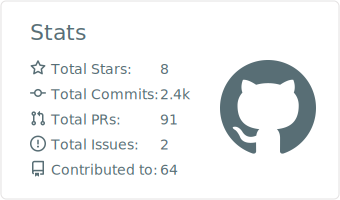

# 안녕하세요, 정선우입니다 👋

**Java/Spring 기반 백엔드 엔지니어**입니다. 매일 학습하고 기록하며, 동작 원리를 밑바닥부터 이해하는 것을 좋아합니다.

- 📝 매일 [TIL](https://github.com/seonwooj0810/TIL) 작성 — Java/Spring/CS 심화 학습 노트
- 🧠 [Java로 미니 LLM 밑바닥부터 구현](https://github.com/seonwooj0810/llm-study) — 토크나이저·어텐션·학습 루프
- 🧱 [Spring Modulith 모듈러 모놀리스 실험](https://github.com/seonwooj0810/spring-modulith-example)

## 🌱 Open Source Contributions

### ✅ Merged

- **spring-projects/spring-batch** — [#5400](https://github.com/spring-projects/spring-batch/pull/5400) `ChunkTaskExecutorItemWriter` 워커 스레드에 step context 전파
- **spring-cloud/spring-cloud-openfeign** — [#1378](https://github.com/spring-cloud/spring-cloud-openfeign/pull/1378) `FeignClientsRegistrar`가 리졸브된 fallbackFactory를 무조건 덮어쓰는 버그 수정
- **FasterXML/jackson-core** — [#1613](https://github.com/FasterXML/jackson-core/pull/1613) JSON5 스타일 hex literal 지원 (`ALLOW_HEXADECIMAL_NUMBERS`) · [#1614](https://github.com/FasterXML/jackson-core/pull/1614) async parser의 `+` 부호 버퍼 경계 손실 버그 수정
- **OpenFeign/feign** — [#3371](https://github.com/OpenFeign/feign/pull/3371) CoroutineFeign 빌더의 `dismiss404` 미전달 수정 · [#3370](https://github.com/OpenFeign/feign/pull/3370) micrometer 모듈 메트릭 문서화
- **OpenAPITools/openapi-generator** — [#23872](https://github.com/OpenAPITools/openapi-generator/pull/23872) Java restclient에서 `useJackson3=true` 시 XmlMapper를 builder로 생성
- **jreleaser/jreleaser** — [#2130](https://github.com/jreleaser/jreleaser/pull/2130) Maven Central 폴링 로그 문구 개선

### 🔍 In Review

- **spring-projects** — spring-security [#19210](https://github.com/spring-projects/spring-security/pull/19210) `InvalidOneTimeTokenException` Jackson Mixin · spring-data-mongodb [#5195](https://github.com/spring-projects/spring-data-mongodb/pull/5195) transient WriteConflict → `ConcurrencyFailureException` 변환 · spring-pulsar [#1506](https://github.com/spring-projects/spring-pulsar/pull/1506) 컨테이너 startup failure 프로퍼티 전파 · spring-batch [#5401](https://github.com/spring-projects/spring-batch/pull/5401) Testcontainers 이미지 버전 정렬
- **spring-cloud/spring-cloud-gateway** — [#4190](https://github.com/spring-cloud/spring-cloud-gateway/pull/4190) gRPC 빈 조건을 grpc-netty 기준으로 가드
- **swagger-api/swagger-core** — [#5192](https://github.com/swagger-api/swagger-core/pull/5192) PropertyNamingStrategy의 get/is 접두사 프로퍼티 처리 · [#5186](https://github.com/swagger-api/swagger-core/pull/5186) 명시적 `@Schema(format)` 우선 적용
- **OpenFeign/feign** — [#3394](https://github.com/OpenFeign/feign/pull/3394) static 기본 async executor의 ClassLoader 누수 방지 · [#3382](https://github.com/OpenFeign/feign/pull/3382) multipart 파라미터의 delegate content type 보존
- **resilience4j/resilience4j** — [#2478](https://github.com/resilience4j/resilience4j/pull/2478) HedgeConfig 복사 시 durationSupplierType 보존 · [#2476](https://github.com/resilience4j/resilience4j/pull/2476) resilience4j-micronaut BOM 추가
- **FasterXML/jackson-core** — [#1615](https://github.com/FasterXML/jackson-core/pull/1615) non-root 숫자 뒤 separator 즉시 검증
- **querydsl/querydsl** — [#3984](https://github.com/querydsl/querydsl/pull/3984) GroupBy 예외 시 `CloseableIterator` 누수 수정
- **mapstruct/mapstruct** — [#4061](https://github.com/mapstruct/mapstruct/pull/4061) no-args 생성자 없는 `SET_TO_DEFAULT`에 컴파일 에러 보고
- **testcontainers/testcontainers-java** — [#11832](https://github.com/testcontainers/testcontainers-java/pull/11832) `DockerDesktopClientProviderStrategy` 항상 applicable 처리되는 버그 수정
- **springdoc/springdoc-openapi** — [#3292](https://github.com/springdoc/springdoc-openapi/pull/3292) SwaggerConfig의 WebProperties 의존 optional 처리

→ [전체 PR 보기](https://github.com/search?q=author%3Aseonwooj0810+is%3Apr+-user%3Aseonwooj0810&type=pullrequests)

## 🛠 Tech Stack

 

## 📊 Stats

  

## ✍️ Latest Posts

[Why Driven Backend](https://velog.io/@jungseonw00) — velog

<!-- BLOG-POST-LIST:START -->
- [synchronized와 ReentrantLock은 내부에서 무엇이 다른가](https://velog.io/@jungseonw00/java-synchronized-vs-reentrantlock)
- [JVM 메모리 정리: Metaspace는 PermGen과 무엇이 다른가](https://velog.io/@jungseonw00/jvm-metaspace-vs-permgen)
- [JVM GC 정리: G1과 ZGC는 무엇이 다른가](https://velog.io/@jungseonw00/jvm-gc-g1-vs-zgc)
- [Kafka acks=all 과 min.insync.replicas — &#39;한 번도 안 잃는다&#39;는 보장은 어디서 오나](https://velog.io/@jungseonw00/kafka-acks-all-min-insync-replicas)
- [Kafka Exactly-Once Semantics 정리: 멱등 프로듀서와 트랜잭션은 무엇을 보장하는가](https://velog.io/@jungseonw00/kafka-exactly-once-semantics)
<!-- BLOG-POST-LIST:END -->

## 🔗 Links

- ✍️ Blog: [velog.io/@jungseonw00](https://velog.io/@jungseonw00)
- 🤖 Made tools: [velog-mcp-go](https://github.com/seonwooj0810/velog-mcp-go) · [velog-mcp-server](https://github.com/seonwooj0810/velog-mcp-server) — Velog용 MCP 서버
