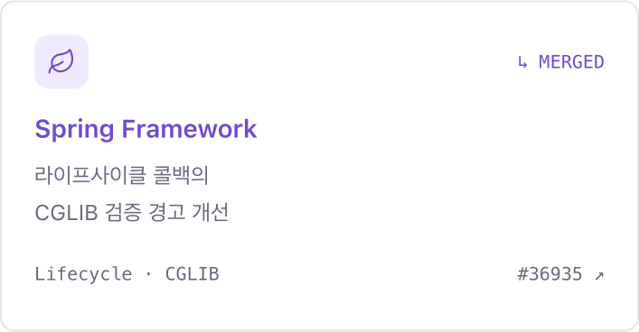
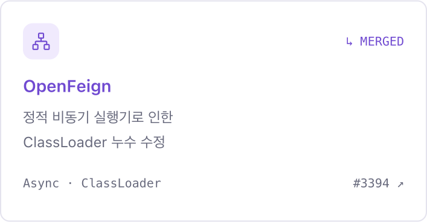
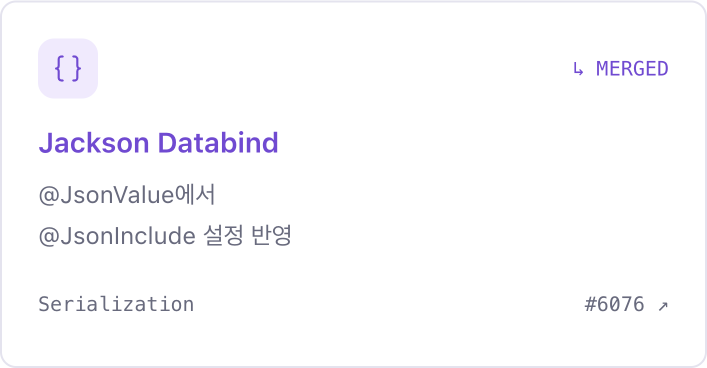
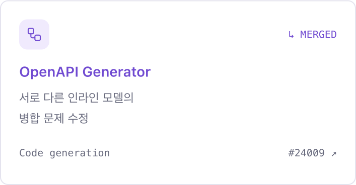
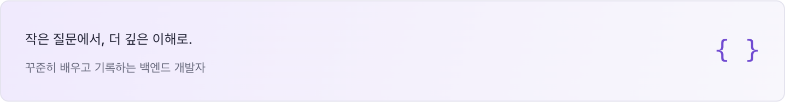

## 안녕하세요, 정선우입니다 👋

**Java/Spring 기반 백엔드 엔지니어**입니다. 
밑바닥의 원리를 탐구하고, 배운 것을 기록하며, 오픈소스에 기여합니다.

  
  

### `01 /` Open source contributions

<!-- OSS-LIST:START -->

  
  

전체 기여 내역 · 68 PRs / 22 projects

**핵심 활동**

 **[spring-boot](https://github.com/spring-projects/spring-boot)** `⭐ 82k` [**#50734**](https://github.com/spring-projects/spring-boot/pull/50734 "High number of connections due to Mongo health indicator") High number of connections due to Mongo health indicator 
 **[spring-framework](https://github.com/spring-projects/spring-framework)** `⭐ 60k` [**#36935**](https://github.com/spring-projects/spring-framework/pull/36935 "Suppress CGLIB validation WARN for lifecycle callbacks") Suppress CGLIB validation WARN for lifecycle callbacks 
 **[netty](https://github.com/netty/netty)** `⭐ 35k` [**#17104**](https://github.com/netty/netty/pull/17104 "Fix NPE in AbstractNioChannel.removeReadOp() after concurrent deregistration") Fix NPE in AbstractNioChannel.removeReadOp() after conc… 
 **[openapi-generator](https://github.com/OpenAPITools/openapi-generator)** `⭐ 27k` [**#25130**](https://github.com/OpenAPITools/openapi-generator/pull/25130 "[kotlin][client] Respect explicit useJackson3=false with useSpringBoot4 on jvm-spring-restclient") [kotlin][client] Respect explicit useJackson3=false wit… 
 **[resilience4j](https://github.com/resilience4j/resilience4j)** `⭐ 11k` [**#2478**](https://github.com/resilience4j/resilience4j/pull/2478 "Preserve durationSupplierType when copying HedgeConfig (#2457)") Preserve durationSupplierType when copying HedgeConfig … 
 **[feign](https://github.com/OpenFeign/feign)** `⭐ 9.8k` [**#3507**](https://github.com/OpenFeign/feign/pull/3507 "Avoid default Content-Type on POST/PUT/PATCH with empty body") Avoid default Content-Type on POST/PUT/PATCH with empty… 
 **[spring-security](https://github.com/spring-projects/spring-security)** `⭐ 9.6k` [**#19341**](https://github.com/spring-projects/spring-security/pull/19341 "Avoid spring-core in password encoder validation") Avoid spring-core in password encoder validation 
 **[mapstruct](https://github.com/mapstruct/mapstruct)** `⭐ 7.7k` [**#4061**](https://github.com/mapstruct/mapstruct/pull/4061 "#4060 Report compilation error for SET_TO_DEFAULT without accessible no-args constructor") #4060 Report compilation error for SET_TO_DEFAULT witho… 

**프로젝트별 요약**

 **[openapi-generator](https://github.com/OpenAPITools/openapi-generator)** `19` 
 **[feign](https://github.com/OpenFeign/feign)** `10` 
 **[logback](https://github.com/qos-ch/logback)** `6` 
 **[jackson-databind](https://github.com/FasterXML/jackson-databind)** `4` 
 **[swagger-core](https://github.com/swagger-api/swagger-core)** `4` 
 **[spring-cloud-openfeign](https://github.com/spring-cloud/spring-cloud-openfeign)** `3` 
 **[jackson-dataformats-text](https://github.com/FasterXML/jackson-dataformats-text)** `3` 
 **[jackson-core](https://github.com/FasterXML/jackson-core)** `3` 
 **[springdoc-openapi](https://github.com/springdoc/springdoc-openapi)** `2` 
 **[netty](https://github.com/netty/netty)** `2` 
 **[swagger-parser](https://github.com/swagger-api/swagger-parser)** `1` 
 **[spring-security](https://github.com/spring-projects/spring-security)** `1` 
 **[spring-framework](https://github.com/spring-projects/spring-framework)** `1` 
 **[jackson-modules-java8](https://github.com/FasterXML/jackson-modules-java8)** `1` 
 **[spring](https://github.com/mybatis/spring)** `1` 
 **[liquibase](https://github.com/liquibase/liquibase)** `1` 
 **[spring-boot](https://github.com/spring-projects/spring-boot)** `1` 
 **[resilience4j](https://github.com/resilience4j/resilience4j)** `1` 
 **[querydsl](https://github.com/OpenFeign/querydsl)** `1` 
 **[mapstruct](https://github.com/mapstruct/mapstruct)** `1` 
 **[jreleaser](https://github.com/jreleaser/jreleaser)** `1` 
 **[spring-batch](https://github.com/spring-projects/spring-batch)** `1` 

프로젝트별 전체 보기 (68건)

 **[openapi-generator](https://github.com/OpenAPITools/openapi-generator)** `19`

- [**#25130**](https://github.com/OpenAPITools/openapi-generator/pull/25130 "[kotlin][client] Respect explicit useJackson3=false with useSpringBoot4 on jvm-spring-restclient") [kotlin][client] Respect explicit useJackson3=false wit…
- [**#24009**](https://github.com/OpenAPITools/openapi-generator/pull/24009 "[BUG] fix(InlineModelResolver): do not merge distinct inline enums sharing the same values (#23978)") [BUG] fix(InlineModelResolver): do not merge distinct i…
- [**#24649**](https://github.com/OpenAPITools/openapi-generator/pull/24649 "[Java] Fix generated build.gradle incompatible with Gradle 9") [Java] Fix generated build.gradle incompatible with Gra…
- [**#24419**](https://github.com/OpenAPITools/openapi-generator/pull/24419 "[BUG][JAVA] Render enum constants in object property defaults (fixes #24298)") [BUG][JAVA] Render enum constants in object property de…
- [**#24392**](https://github.com/OpenAPITools/openapi-generator/pull/24392 "[Java][RestClient] Mark non-required API method parameters @Nullable under JSpecify") [Java][RestClient] Mark non-required API method paramet…
- [**#24385**](https://github.com/OpenAPITools/openapi-generator/pull/24385 "fix(java): render enum default on allOf + $ref composed property (#24384)") fix(java): render enum default on allOf + $ref composed…
- [**#24114**](https://github.com/OpenAPITools/openapi-generator/pull/24114 "[Java] Generate nullability annotations on all-args constructor parameters") [Java] Generate nullability annotations on all-args con…
- [**#23967**](https://github.com/OpenAPITools/openapi-generator/pull/23967 "[BUG][core] Normalize OAS 3.1 `type: null` map value (additionalProperties) under NORMALIZE_31SPEC") [BUG][core] Normalize OAS 3.1 `type: null` map value (a…
- [**#24218**](https://github.com/OpenAPITools/openapi-generator/pull/24218 "fix(kotlin-server): use valid Kotlin String conversions for ktor delegate header params") fix(kotlin-server): use valid Kotlin String conversions…
- [**#24062**](https://github.com/OpenAPITools/openapi-generator/pull/24062 "[Go] Honor generateUnmarshalJSON=false for oneOf models") [Go] Honor generateUnmarshalJSON=false for oneOf models
- [**#24047**](https://github.com/OpenAPITools/openapi-generator/pull/24047 "[kotlin] Add @get:JsonValue to nested Jackson enums (#23886)") [kotlin] Add @get:JsonValue to nested Jackson enums (#2…
- [**#23982**](https://github.com/OpenAPITools/openapi-generator/pull/23982 "[typescript-fetch] Fix TS2590 in instanceOf guards for wide sanitized-name models (#23980)") [typescript-fetch] Fix TS2590 in instanceOf guards for …
- [**#24127**](https://github.com/OpenAPITools/openapi-generator/pull/24127 "[Java] Skip wildcard media types when selecting request Content-Type (#24118)") [Java] Skip wildcard media types when selecting request…
- [**#23971**](https://github.com/OpenAPITools/openapi-generator/pull/23971 "[Java] Render object default for composed ($ref + default) schemas (#23795)") [Java] Render object default for composed ($ref + defau…
- [**#24072**](https://github.com/OpenAPITools/openapi-generator/pull/24072 "[python] Run regex pattern validators in mode=&quot;before&quot; so they see the wire value (#24065)") [python] Run regex pattern validators in mode="before" …
- [**#24081**](https://github.com/OpenAPITools/openapi-generator/pull/24081 "[core] Restore sibling example for allOf with a single $ref (#23335)") [core] Restore sibling example for allOf with a single …
- [**#24076**](https://github.com/OpenAPITools/openapi-generator/pull/24076 "[core] Fix UnsupportedOperationException for oneOf members declaring x-implements (#23577)") [core] Fix UnsupportedOperationException for oneOf memb…
- [**#24017**](https://github.com/OpenAPITools/openapi-generator/pull/24017 "[Java][vertx] Apply Vert.x pool defaults in buildWebClient for useVertx5 (#24015)") [Java][vertx] Apply Vert.x pool defaults in buildWebCli…
- [**#23872**](https://github.com/OpenAPITools/openapi-generator/pull/23872 "[Java][restclient] Build XmlMapper via builder when useJackson3=true") [Java][restclient] Build XmlMapper via builder when use…

 **[feign](https://github.com/OpenFeign/feign)** `10`

- [**#3507**](https://github.com/OpenFeign/feign/pull/3507 "Avoid default Content-Type on POST/PUT/PATCH with empty body") Avoid default Content-Type on POST/PUT/PATCH with empty…
- [**#3415**](https://github.com/OpenFeign/feign/pull/3415 "Return response body in FeignException from errorReading (#2618)") Return response body in FeignException from errorReadin…
- [**#3382**](https://github.com/OpenFeign/feign/pull/3382 "Preserve delegate content type for multipart parameters") Preserve delegate content type for multipart parameters
- [**#3422**](https://github.com/OpenFeign/feign/pull/3422 "Make Expressions max length configurable (fixes #2916)") Make Expressions max length configurable (fixes #2916)
- [**#3419**](https://github.com/OpenFeign/feign/pull/3419 "Honor jdk.httpclient.allowRestrictedHeaders in Http2Client (#2975)") Honor jdk.httpclient.allowRestrictedHeaders in Http2Cli…
- [**#3406**](https://github.com/OpenFeign/feign/pull/3406 "Fix feign-core test compilation broken by removed Request.create overload") Fix feign-core test compilation broken by removed Reque…
- [**#3394**](https://github.com/OpenFeign/feign/pull/3394 "Avoid ClassLoader leak from static default async executor (#3178)") Avoid ClassLoader leak from static default async execut…
- [**#3407**](https://github.com/OpenFeign/feign/pull/3407 "Open observation scope and stop on non-FeignException errors") Open observation scope and stop on non-FeignException e…
- [**#3371**](https://github.com/OpenFeign/feign/pull/3371 "Forward dismiss404 from CoroutineFeign builder to AsyncFeign") Forward dismiss404 from CoroutineFeign builder to Async…
- [**#3370**](https://github.com/OpenFeign/feign/pull/3370 "Document metrics published by the micrometer module") Document metrics published by the micrometer module

 **[logback](https://github.com/qos-ch/logback)** `6`

- [**#1051**](https://github.com/qos-ch/logback/pull/1051 "Support HALF_DAY periodicity for AM/PM date patterns") Support HALF_DAY periodicity for AM/PM date patterns
- [**#1055**](https://github.com/qos-ch/logback/pull/1055 "Fix data race on LoggerContext.size (#1038)") Fix data race on LoggerContext.size (#1038)
- [**#1060**](https://github.com/qos-ch/logback/pull/1060 "Do not extract caller data in async worker when includeCallerData is false") Do not extract caller data in async worker when include…
- [**#1056**](https://github.com/qos-ch/logback/pull/1056 "Detect file collisions in SiftingAppender nested appenders (#1041)") Detect file collisions in SiftingAppender nested append…
- [**#1052**](https://github.com/qos-ch/logback/pull/1052 "Fail loudly when LayoutWrappingEncoder has no layout (#1046)") Fail loudly when LayoutWrappingEncoder has no layout (#…
- [**#1050**](https://github.com/qos-ch/logback/pull/1050 "ConsoleAppender: support JLine's org.jline.jansi.AnsiConsole for <withJansi>") ConsoleAppender: support JLine's org.jline.jansi.AnsiCo…

 **[jackson-databind](https://github.com/FasterXML/jackson-databind)** `4`

- [**#6151**](https://github.com/FasterXML/jackson-databind/pull/6151 "Add `DateTimeFeature.ALWAYS_WRITE_SUBSECOND_DIGITS`") Add `DateTimeFeature.ALWAYS_WRITE_SUBSECOND_DIGITS`
- [**#6076**](https://github.com/FasterXML/jackson-databind/pull/6076 "Fix #4762: @JsonValue should honor @JsonInclude on annotated accessor") Fix #4762: @JsonValue should honor @JsonInclude on anno…
- [**#6102**](https://github.com/FasterXML/jackson-databind/pull/6102 "Fix #6101: omit NON_EMPTY Map when CUSTOM content filter removes all entries") Fix #6101: omit NON_EMPTY Map when CUSTOM content filte…
- [**#6047**](https://github.com/FasterXML/jackson-databind/pull/6047 "Fix #6043: honor FAIL_ON_UNKNOWN_PROPERTIES for creator-based POJOs-as-Array") Fix #6043: honor FAIL_ON_UNKNOWN_PROPERTIES for creator…

 **[swagger-core](https://github.com/swagger-api/swagger-core)** `4`

- [**#5192**](https://github.com/swagger-api/swagger-core/pull/5192 "Honor PropertyNamingStrategy for get/is-prefixed property names") Honor PropertyNamingStrategy for get/is-prefixed proper…
- [**#5205**](https://github.com/swagger-api/swagger-core/pull/5205 "fix: emit $ref for array items when cycle guard suppresses implementation processing") fix: emit $ref for array items when cycle guard suppres…
- [**#5193**](https://github.com/swagger-api/swagger-core/pull/5193 "Restore inner property name from map key in handleUnwrapped") Restore inner property name from map key in handleUnwra…
- [**#5186**](https://github.com/swagger-api/swagger-core/pull/5186 "fix: let explicit @Schema(format) override type-derived format (#5185)") fix: let explicit @Schema(format) override type-derived…

 **[spring-cloud-openfeign](https://github.com/spring-cloud/spring-cloud-openfeign)** `3`

- [**#1416**](https://github.com/spring-cloud/spring-cloud-openfeign/pull/1416 "Fix HttpHeaders header-map params losing values via QueryMapEncoder") Fix HttpHeaders header-map params losing values via Que…
- [**#1384**](https://github.com/spring-cloud/spring-cloud-openfeign/pull/1384 "Fix concurrent initialization race in FeignHttpMessageConverters") Fix concurrent initialization race in FeignHttpMessageC…
- [**#1378**](https://github.com/spring-cloud/spring-cloud-openfeign/pull/1378 "Fix unconditional overwrite of resolved fallbackFactory in FeignClientsRegistrar") Fix unconditional overwrite of resolved fallbackFactory…

 **[jackson-dataformats-text](https://github.com/FasterXML/jackson-dataformats-text)** `3`

- [**#703**](https://github.com/FasterXML/jackson-dataformats-text/pull/703 "Add name-based column modification to `CsvSchema.Builder` (#699)") Add name-based column modification to `CsvSchema.Builde…
- [**#705**](https://github.com/FasterXML/jackson-dataformats-text/pull/705 "Fix #701: quote YAML 1.1 number-form Strings under ALWAYS_QUOTE_NUMBERS_AS_STRINGS") Fix #701: quote YAML 1.1 number-form Strings under ALWA…
- [**#697**](https://github.com/FasterXML/jackson-dataformats-text/pull/697 "Fix #696: write non-finite TOML floats as nan/inf/-inf") Fix #696: write non-finite TOML floats as nan/inf/-inf

 **[jackson-core](https://github.com/FasterXML/jackson-core)** `3`

- [**#1624**](https://github.com/FasterXML/jackson-core/pull/1624 "Fix #1622: size base64 encoding buffer from binary length hint") Fix #1622: size base64 encoding buffer from binary leng…
- [**#1613**](https://github.com/FasterXML/jackson-core/pull/1613 "Add JsonReadFeature.ALLOW_HEXADECIMAL_NUMBERS for JSON5-style hex literals (#707)") Add JsonReadFeature.ALLOW_HEXADECIMAL_NUMBERS for JSON5…
- [**#1614**](https://github.com/FasterXML/jackson-core/pull/1614 "Preserve explicit &quot;+&quot; sign across buffer boundaries for &quot;+0...&quot; on async parser") Preserve explicit "+" sign across buffer boundaries for…

 **[springdoc-openapi](https://github.com/springdoc/springdoc-openapi)** `2`

- [**#3296**](https://github.com/springdoc/springdoc-openapi/pull/3296 "Fix #3282: preserve nest() version predicate across all routes in nest") Fix #3282: preserve nest() version predicate across all…
- [**#3292**](https://github.com/springdoc/springdoc-openapi/pull/3292 "Make WebProperties and WebMvcProperties optional in SwaggerConfig") Make WebProperties and WebMvcProperties optional in Swa…

 **[netty](https://github.com/netty/netty)** `2`

- [**#17104**](https://github.com/netty/netty/pull/17104 "Fix NPE in AbstractNioChannel.removeReadOp() after concurrent deregistration") Fix NPE in AbstractNioChannel.removeReadOp() after conc…
- [**#17140**](https://github.com/netty/netty/pull/17140 "Avoid classloader leak via GlobalEventExecutor terminationFuture failure") Avoid classloader leak via GlobalEventExecutor terminat…

 **[swagger-parser](https://github.com/swagger-api/swagger-parser)** `1`

- [**#2349**](https://github.com/swagger-api/swagger-parser/pull/2349 "Resolve same-named schemas from different files as distinct components (fixes #2333)") Resolve same-named schemas from different files as dist…

 **[spring-security](https://github.com/spring-projects/spring-security)** `1`

- [**#19341**](https://github.com/spring-projects/spring-security/pull/19341 "Avoid spring-core in password encoder validation") Avoid spring-core in password encoder validation

 **[spring-framework](https://github.com/spring-projects/spring-framework)** `1`

- [**#36935**](https://github.com/spring-projects/spring-framework/pull/36935 "Suppress CGLIB validation WARN for lifecycle callbacks") Suppress CGLIB validation WARN for lifecycle callbacks

 **[jackson-modules-java8](https://github.com/FasterXML/jackson-modules-java8)** `1`

- [**#386**](https://github.com/FasterXML/jackson-modules-java8/pull/386 "Add `JavaTimeFeature.ALWAYS_WRITE_SUBSECOND_DIGITS` (#76)") Add `JavaTimeFeature.ALWAYS_WRITE_SUBSECOND_DIGITS` (#7…

 **[spring](https://github.com/mybatis/spring)** `1`

- [**#1258**](https://github.com/mybatis/spring/pull/1258 "fix: exclude annotation types from mapper candidate components") fix: exclude annotation types from mapper candidate com…

 **[liquibase](https://github.com/liquibase/liquibase)** `1`

- [**#7812**](https://github.com/liquibase/liquibase/pull/7812 "fix(snapshot): close owning Statement in ResultSetCache.extract to prevent JDBC Statement leak") fix(snapshot): close owning Statement in ResultSetCache…

 **[spring-boot](https://github.com/spring-projects/spring-boot)** `1`

- [**#50734**](https://github.com/spring-projects/spring-boot/pull/50734 "High number of connections due to Mongo health indicator") High number of connections due to Mongo health indicator

 **[resilience4j](https://github.com/resilience4j/resilience4j)** `1`

- [**#2478**](https://github.com/resilience4j/resilience4j/pull/2478 "Preserve durationSupplierType when copying HedgeConfig (#2457)") Preserve durationSupplierType when copying HedgeConfig …

 **[querydsl](https://github.com/OpenFeign/querydsl)** `1`

- [**#1791**](https://github.com/OpenFeign/querydsl/pull/1791 "Render object arrays as Kotlin Array<T> in querydsl-kotlin-codegen (#1790)") Render object arrays as Kotlin Array<T> in querydsl-kot…

 **[mapstruct](https://github.com/mapstruct/mapstruct)** `1`

- [**#4061**](https://github.com/mapstruct/mapstruct/pull/4061 "#4060 Report compilation error for SET_TO_DEFAULT without accessible no-args constructor") #4060 Report compilation error for SET_TO_DEFAULT witho…

 **[jreleaser](https://github.com/jreleaser/jreleaser)** `1`

- [**#2130**](https://github.com/jreleaser/jreleaser/pull/2130 "fix(deploy): clarify Maven Central polling log wording") fix(deploy): clarify Maven Central polling log wording

 **[spring-batch](https://github.com/spring-projects/spring-batch)** `1`

- [**#5400**](https://github.com/spring-projects/spring-batch/pull/5400 "Propagate step context to worker threads in ChunkTaskExecutorItemWriter") Propagate step context to worker threads in ChunkTaskEx…

<!-- OSS-LIST:END -->

  <a href="https://github.com/spring-projects/spring-framework/pull/36935">
    <picture>
      <source media="(prefers-color-scheme: dark)" srcset="assets/spring-framework-dark.png"/>
      
    </picture>
  </a>
  <a href="https://github.com/OpenFeign/feign/pull/3394">
    <picture>
      <source media="(prefers-color-scheme: dark)" srcset="assets/openfeign-dark.png"/>
      
    </picture>
  </a>

  <a href="https://github.com/FasterXML/jackson-databind/pull/6076">
    <picture>
      <source media="(prefers-color-scheme: dark)" srcset="assets/jackson-databind-dark.png"/>
      
    </picture>
  </a>
  <a href="https://github.com/OpenAPITools/openapi-generator/pull/24009">
    <picture>
      <source media="(prefers-color-scheme: dark)" srcset="assets/openapi-generator-dark.png"/>
      
    </picture>
  </a>

[전체 PR 보기 ↗](https://github.com/search?q=author%3Aseonwooj0810+is%3Apr+-user%3Aseonwooj0810+-org%3Ageonganghaegym+-org%3Aseonwooj0810-homelab+-org%3Amalitda+-org%3Attalkkak-league&type=pullrequests)

### `02 /` Learning in public

[Why Driven Backend ↗](https://velog.io/@jungseonw00) · Java / Spring / CS 학습과 기록

<!-- BLOG-POST-LIST:START -->
- 2026-10-07 — [스레드 32개를 붙여도 LongAdder 셀이 8개뿐인 이유 — Striped64의 base 우선과 NCPU 상한](https://velog.io/@jungseonw00/longadder-striped64-cell-striping)
- 2026-10-05 — [Kubernetes 노드 메모리가 바닥나면 누가 먼저 죽는가 — QoS 클래스가 아니라 usage − request](https://velog.io/@jungseonw00/kubernetes-qos-oom-eviction-order)
- 2026-10-03 — [connect&lpar;&rpar;는 성공했는데 첫 요청이 멈추는 이유 — Linux listen backlog와 accept 큐 오버플로](https://velog.io/@jungseonw00/linux-listen-backlog-accept-queue-overflow)
- 2026-10-03 — [카운터가 4 늘었는데 increase&lpar;&rpar;는 왜 5.33일까 — Prometheus rate의 경계 외삽](https://velog.io/@jungseonw00/prometheus-rate-extrapolation)
- 2026-10-02 — [3KB 값은 본 테이블에 남고 1.5KB 값은 밖으로 나가는 이유 — PostgreSQL TOAST 4단계 루프](https://velog.io/@jungseonw00/postgresql-toast-four-pass-loop)
<!-- BLOG-POST-LIST:END -->

 

<picture>
  <source media="(prefers-color-scheme: dark)" srcset="assets/closing-dark.png"/>
  
</picture>
